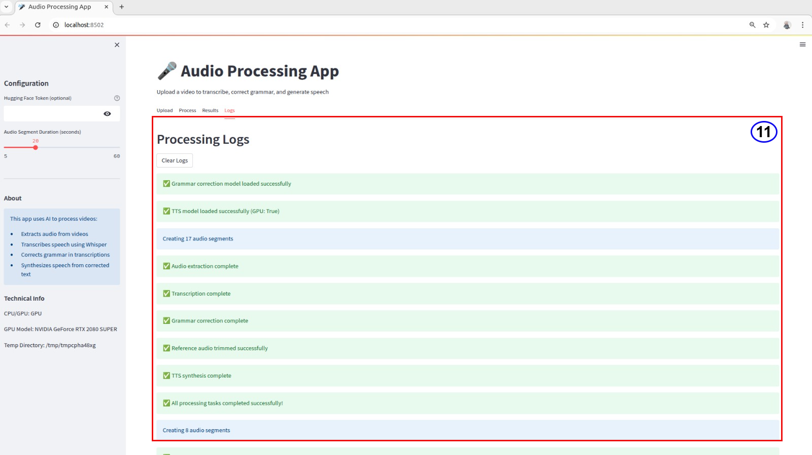

## 📖 Project Overview

In this project presents a turnkey Streamlit web application that exposes the entire speech‑processing and re‑synchronisation stack—audio extraction, chunking, automatic speech recognition (ASR), grammatical error correction (GEC), cross‑lingual text‑to‑speech (TTS), and automatic lip‑sync regeneration—through a single interactive dashboard. Users can upload any video, adjust segment duration, provide an optional Hugging Face token, monitor colour‑coded progress bars and live logs, and download every intermediate artefact: the full WAV track, per‑segment clips, SRT subtitles, raw and corrected transcripts, cloned‑voice WAV output, and the final lip‑synced MP4. Under the hood the app orchestrates Pydub for audio handling, OpenAI Whisper‑medium for ASR, a fine‑tuned T5‑base GEC model, and Coqui XTTS‑v2 for zero‑shot speaker cloning, with all models cached by Streamlit’s resource manager and GPU‑accelerated when available. Once the corrected speech is synthesised, ByteDance LatentSync‑1.5 re‑aligns the speaker’s mouth movements in the original video to the updated audio track, producing frame‑accurate lip‑sync.

<!-- Image goes here -->

## Output WAV Sample

<audio src="Assets/generated_speech.wav" controls></audio>

Python: 3.10
##
CUDA: conda install pytorch==2.1.0 torchvision torchaudio pytorch-cuda=11.8 -c pytorch -c nvidia
---
