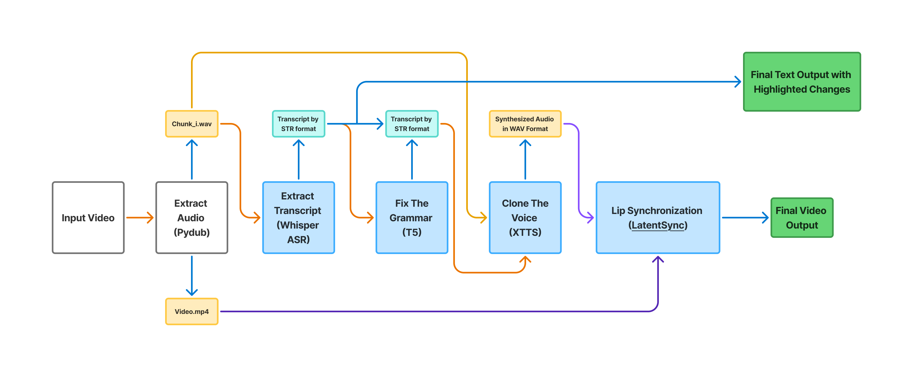
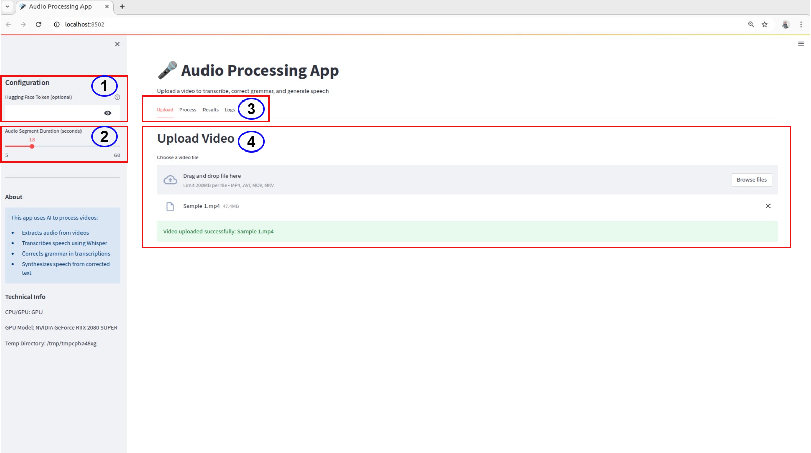
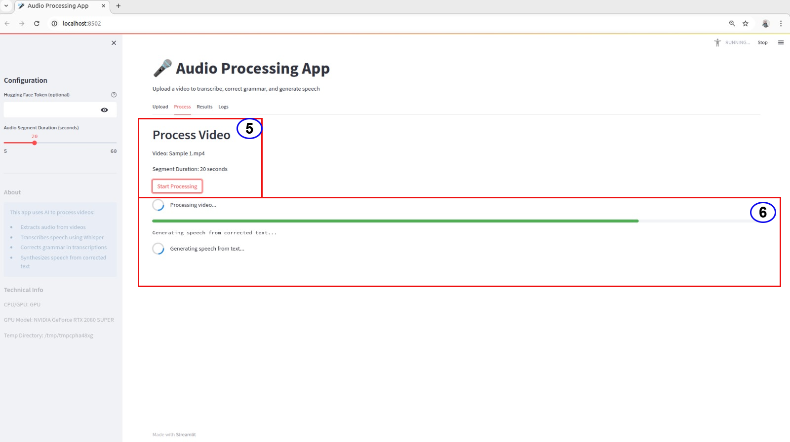
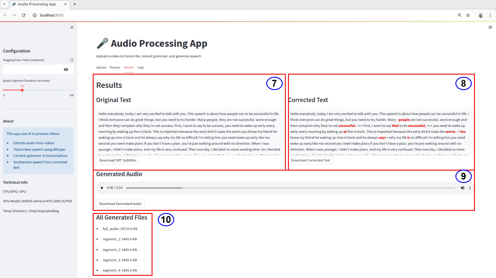

# 🎬 AccentFlow: Automated Video Speech Correction & Lip-Sync Regeneration

A production-ready Python application for **speech correction and video re-synchronization**, built with **Streamlit**, **Whisper ASR**, **T5 Grammar Correction**, **XTTS Voice Cloning**, and **LatentSync Lip-Synchronization**.

---

## 🎯 Project Overview

AccentFlow provides a **turnkey web interface** to automatically extract, correct, and re-synthesize speech from videos — and then re-align lip movements to the corrected audio.
The system integrates **automatic speech recognition**, **grammatical error correction**, **voice cloning**, and **lip-sync restoration** into a single streamlined workflow.







---

## ✨ Key Features

* **End-to-End Processing**
  Upload a video and get a fully corrected, lip-synchronized version — all in one click.

* **Accurate Speech Transcription**
  Uses **OpenAI Whisper** for robust automatic speech recognition (ASR).

* **Context-Aware Grammar Correction**
  Leverages a fine-tuned **T5 model** for high-precision grammatical and stylistic improvements.

* **Voice Cloning & Synthesis**
  Employs **Coqui XTTS-v2** for zero-shot speaker voice cloning and re-synthesis.

* **Frame-Accurate Lip-Synchronization**
  Utilizes **ByteDance LatentSync-1.5** to precisely match facial motion to re-generated speech.

* **Interactive Streamlit Dashboard**
  Includes progress tracking, live logs, and direct download links for all intermediate results.

---

## 🧩 Processing Pipeline Architecture

AccentFlow executes a modular, event-driven speech-processing flow:

```mermaid
graph TD
    A[Input Video] --> B[Extract Audio (Pydub)];
    B --> C[Extract Transcript (Whisper ASR)];
    C --> D[Fix Grammar (T5 Model)];
    D --> E[Clone Voice (XTTS)];
    E --> F[Lip Synchronization (LatentSync)];
    F --> G[Final Video Output];
    D --> H[Final Text Output with Highlighted Changes];
```

**Output Artifacts:**

* Full WAV track (`generated_speech.wav`)
* Per-segment audio clips (`chunk_i.wav`)
* Raw & corrected transcripts (`.txt` / `.srt`)
* Lip-synchronized MP4 video (`output_final.mp4`)

---

## 🏗️ Project Structure

```
ACCENTFLOW/
├── 📂 src/                           # Core source modules
│   ├── asr.py                        # Whisper ASR transcription
│   ├── audio_utils.py                # Audio extraction & chunking
│   ├── config.py                     # App and directory configuration
│   ├── models.py                     # Model loading (T5, XTTS)
│   ├── pipeline.py                   # Main speech-correction pipeline
│   ├── text_utils.py                 # Grammar correction & diff highlighting
│   ├── ui.py                         # Streamlit UI layout & logging
├── app.py                            # Streamlit app entry point
├── environment.yml                   # Conda environment setup
├── requirements.txt                  # Python dependencies
├── README.md                         # Documentation
└── Sample 1.mp4                      # Example input video
```

---

## ⚙️ Core Components

| Component               | Framework            | Description                                    |
| ----------------------- | -------------------- | ---------------------------------------------- |
| **ASR**                 | OpenAI Whisper       | High-accuracy multilingual speech-to-text      |
| **Grammar Correction**  | T5-base (fine-tuned) | Contextual grammar and fluency correction      |
| **TTS / Voice Cloning** | Coqui XTTS-v2        | Zero-shot voice cloning for corrected speech   |
| **Lip-Sync Engine**     | LatentSync-1.5       | Frame-accurate synchronization of mouth motion |
| **Frontend**            | Streamlit            | User-friendly interface with live feedback     |

---

## 🚀 Quick Start

### 1️⃣ Environment Setup

```bash
conda env create -f environment.yml
conda activate accentflow
```

Or manually:

```bash
conda install pytorch==2.1.0 torchvision torchaudio pytorch-cuda=11.8 -c pytorch -c nvidia
pip install -r requirements.txt
```

### 2️⃣ Launch the Application

```bash
streamlit run app.py
```

### 3️⃣ Usage

1. Upload a video (`.mp4`, `.mov`, `.mkv`).
2. Optionally enter your **Hugging Face Token**.
3. Choose segment duration (default: 10 s).
4. Click **Start Processing** to begin.
5. Review logs and download results in the **Results** tab.

---

## 🎧 Example Output

<audio src="Assets/generated_speech.wav" controls></audio>

---

## 🧠 Model Integration Flow

| Stage | Model      | Function                             |
| ----- | ---------- | ------------------------------------ |
| ①     | Whisper    | Converts audio → transcript          |
| ②     | T5         | Corrects grammar and structure       |
| ③     | XTTS       | Re-synthesizes corrected voice       |
| ④     | LatentSync | Aligns lip movements with new speech |

---

## 📜 License

MIT License © 2025
Developed for academic and research use.
Contributions and citations welcome.
